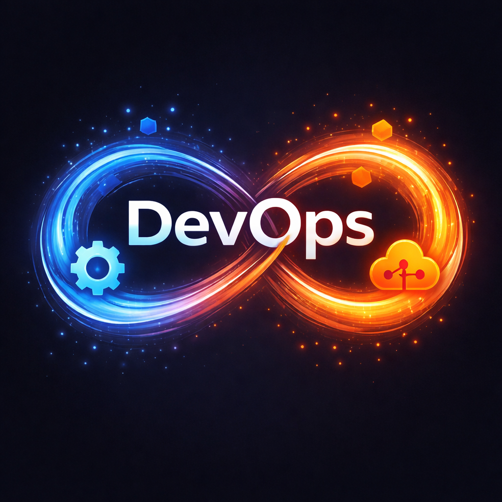

<h1 align="center">Hi 👋, I'm Nikhil R Gowda</h1>
<h3 align="center">🚀 A Passionate AWS DevOps Engineer from India </h3>

  

---

## 👨‍💻 About Me

- 🔭 I’m currently working on **My Own Projects**
- 🌱 I’m currently learning **New Technologies**
- 💬 Ask me about **AWS ☁️ and DevOps ⚙️**
- 👨‍💻 All of my projects are available at **[GitHub](https://github.com/nikhil23407)**
- 📫 How to reach me: **nikhil23407@gmail.com**

---

## 🌐 Connect With Me

  
  

## 🛠️ Tools & Technologies

  
  &nbsp;&nbsp;&nbsp;
  

  

    
    
    
    
    
    
    
    
    
    
  

